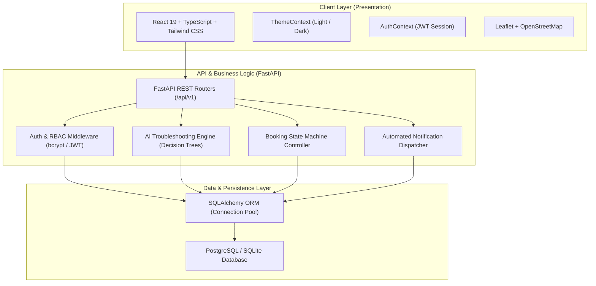
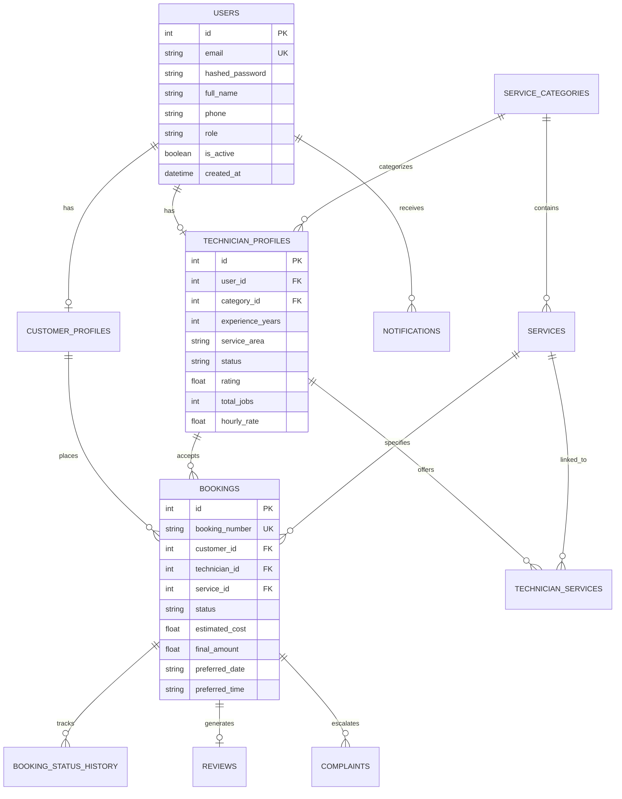
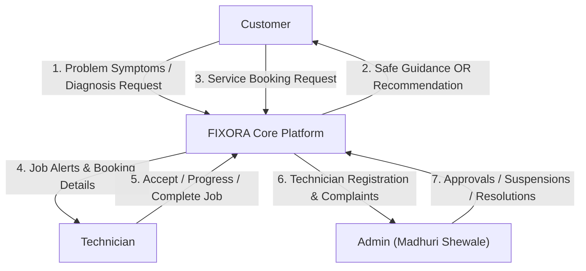
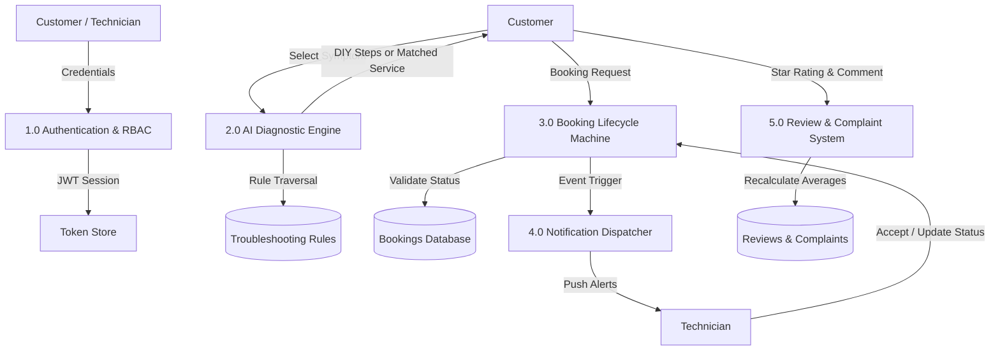
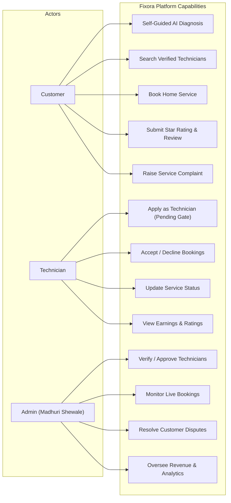

# System Architecture & Diagrams
## FIXORA: “Diagnose First. Book Only When Needed.”
**Lead Engineer / Admin:** Madhuri Shewale (`madhurishewale078@gmail.com`)

---

## 1. High-Level System Architecture

---

## 2. Entity-Relationship (ER) Diagram

---

## 3. Data Flow Diagrams (DFD)

### 3.1 DFD Level 0 (Context Diagram)

### 3.2 DFD Level 1 (Decomposition Diagram)

---

## 4. Use Case Diagram

